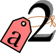
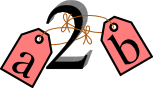

Variables: Cajas vs Etiquetas
=============================

A diferencia de otros lenguajes, Python no trabaja con el consepto de
variables como una caja donde podemos guardar valores. En su lugar, usa
las variables como etiquetas que hacen referencia a valores, que si bien
son parecidos, no son exactamente lo mismo. Cuando decimos que guardamos
un valor en una caja, lo que en realidad hace la computadora es acceder
a una posición de memoria y escribir en esa posición.

+--------------------+----------------------------+----------------------------+
| Ejemplo            | Cajas                      | Etiquetas                  |
+====================+============================+============================+
| Si a la variable   | Guardamos el valor 1       | Hacemos que la referencia  |
| **a** le asignamos | en la caja **a**           | **a** apunte al valor 1    |
| el número 1        |                            |                            |
|                    | |image0|                   | |image1|                   |
+--------------------+----------------------------+----------------------------+
| Y cuando a esa     | Pisamos el valor de        | Nuestra referencia deja de |
| variable queremos  | **a** y guardamos          | apuntar a donde lo hacía   |
| asignarle el       | el valor 2                 | antes, ahora apunta a una  |
| número 2           |                            | nueva posición de memoria; |
|                    | |image2|                   | quedando el número 1 sin   |
|                    |                            | ser apuntado por nadie     |
|                    |                            |                            |
|                    |                            | |image3| |image4|          |
+--------------------+----------------------------+----------------------------+
| Y al decir que la  | En este caso se crea       | Al copiar el contenido, lo |
| variable **a** es  | una nueva caja con el      | que se copia es la         |
| igual a la         | valor 2                    | referencia                 |
| variable **b** lo  |                            |                            |
| que sucede es que  |                            |                            |
| se copia el        | |image5| |image6|          | |image7|                   |
| contenido de **a** |                            |                            |
| en **b**           |                            |                            |
+--------------------+----------------------------+----------------------------+

Esto en python se puede ver usando la función
`id <https://docs.python.org/3/library/functions.html#id>`__:

.. |image0| image:: a1box.png
.. |image1| image:: a1tag.png
.. |image2| image:: a2box.png
.. |image3| image:: 1.png

.. |image5| image:: a2box.png
.. |image6| image:: b2box.png

.. codelens:: py_15

    print('La posición del número 1 es:', id(1))
    x = 1
    print('La posición de X que apunta al número 1 es:', id(x))
    print('¿Y si al número 1 lo incremento?')
    x += 1
    print('La posición de X ahora apunta a:', id(x))
    lista_de_unos = [1, 1, 1, 1, 1]
    print('La lista tiene los elementos:', lista_de_unos)
    posiciones_de_memoria = [id(1), id(1), id(1), id(1), id(1)]
    
    print('Las posiciones de esos elementos son:', posiciones_de_memoria)

Tipos de datos mutables e inmutables
------------------------------------

En python se pueden diferenciar entre los tipos de datos en mutables e
inmutables. Que una variable sea inmutable significa que cada vez que se
la modifica, en realidad, lo que sucede es que se crea un nuevo valor y
esa variable pasa a apuntarlo:

.. codelens:: py_16

    x = 1
    print('El valor de X es:', x)
    print('La posición de X que apunta al número 1 es:', id(x))
    print('¿Y si al número 1 lo incremento?')
    x += 1
    print('El valor de X es:', x)
    print('La posición de X ahora apunta a:', id(x))

En cambio, cuando lo que hacemos es modificar una variable mutable, como
pueden ser las listas, lo que sucede es que esa variable sigue apuntando
al mismo lugar, pero ahora lo que se modificó es el valor que contiene:

.. codelens:: py_17

    x = []
    print('El valor de X es:', x)
    print('La posición de X que apunta a la lista vacía es:', id(x))
    print('¿Y si le agrego el número 1 a la lista?')
    x.append(1)
    print('Ahora, la lista X tiene los elementos:', x)
    print('Y sin embargo, la posición a la que apunta X es:', id(x))
    print()
    x = [1, 2, 3]
    print('Sin embargo, si a X le asignamos una nueva lista:', id(x))

Los tipos de datos **inmutables** son: 

* int 
* str 
* long 
* float 
* bool
* None
* tuple

Los tipos de datos **mutables** son: 

* list
* dict
* set

Para más información sobre la modificación de variables mutables e
inmutables pueden ver el siguiente
`link <http://www.mclibre.org/consultar/python/lecciones/python_variables_2.html#L1822>`__

