.. raw:: html

   <!--
   24/11
   Estructuras de datos: pilas, colas, listas
   Usando objetos en Python (usando listas)
   -->

Pilas, Colas y Listas
=====================

Además de las estructuras de datos que nos ofrece Python, nosotros
también podemos crear nuestras propias estructuras.

Pilas
-----

Por ejemplo, podemos crear una estructura que nos permita hacer tres
cosas simples: 1. guardar una cantidad variable de elementos 1. obtener
(y quitar) el **último** elemento insertado 1. preguntar si esa
estructura tiene o no elementos

Si a esa estructura la llamamos **Pila**, podría tener una estructura
similar a la siguiente:

.. code:: python

    class Pila(object):
        
        def apilar(self, elemento):
            """Guarda el elemento a insertar al final de la pila"""
            ...

        def desapilar(self):
            """Quita y retorna eltimo elemento insertado en la pila"""
            ...

        def esta_vacia(self):
            """Devuelve True si la pila no contiene elementos y 
            False en el caso de que tenga al menos un elemento"""
            ...

Y si suponemos que la guardamos en un archivo llamado ``pcl.py``
podríamos usarla de la siguiente forma:

.. code:: python

    from pcl import Pila
    
    # Creo la pila
    p = Pila()
    
    print 'La pila vacía se ve como:', p
    
    # Le agrego elementos
    p.apilar(5)
    print 'Luego de agregar el 5, la pila se ve como:', p
    
    p.apilar(7)
    print 'Luego de agregar el 7, la pila se ve como:', p
    
    p.apilar(9)
    print 'Luego de agregar el 9, la pila se ve como:', p
    print 'Despues de agregar los elementos 5, 7 y 9 me queda la pila con los elementos ', p
    
    ultimo = p.desapilar()
    print 'Saco el elemento {elemento} y me queda {pila}'.format(elemento=ultimo, pila=p)
    
    ultimo = p.desapilar()
    print 'Saco el elemento {elemento} y me queda {pila}'.format(elemento=ultimo, pila=p)
    
    print '¿La lista esta vacía?: {esta_vacia}'.format(esta_vacia=p.esta_vacia())
    
    ultimo = p.desapilar()
    print 'Saco el elemento {elemento} y me queda {pila}'.format(elemento=ultimo, pila=p)
    
    print '¿Esta vacía?: {esta_vacia}'.format(esta_vacia=p.esta_vacia())

.. parsed-literal::

    La pila vacía se ve como: <Pila: >
    Luego de agregar el 5, la pila se ve como: <Pila: 5 | >
    Luego de agregar el 7, la pila se ve como: <Pila: 7 | 5 | >
    Luego de agregar el 9, la pila se ve como: <Pila: 9 | 7 | 5 | >
    Despues de agregar los elementos 5, 7 y 9 me queda la pila con los elementos  <Pila: 9 | 7 | 5 | >
    Saco el elemento 9 y me queda <Pila: 7 | 5 | >
    Saco el elemento 7 y me queda <Pila: 5 | >
    ¿La lista esta vacía?: False
    Saco el elemento 5 y me queda <Pila: >
    ¿Esta vacía?: True

Colas
-----

También podemos crear una estructura que nos permita hacer tres cosas
simples: 1. guardar una cantidad variable de elementos 1. obtener (y
quitar) el **primer** elemento insertado 1. preguntar si esa estructura
tiene o no elementos

Si a esa estructura la llamamos **Cola**, podría tener una estructura
similar a la siguiente:

.. code:: python

    class Cola(object):

        def encolar(self, elemento):
            """Guarda el elemento a insertar al final de la cola"""
            ...

        def desencolar(self):
            """Quita y retorna el primer elemento insertado"""
            ...

        def esta_vacia(self):
            """Devuelve True si la cola no contiene elementos y 
            False en el caso de que tenga al menos un elemento"""
            ...

.. code:: python

    from pcl import Cola
    
    c = Cola()
    
    # Agrego elementos
    c.encolar(5)
    print 'Despues de agregar el 5 tengo: ', c
    
    c.encolar(7)
    
    print 'Despues de agregar el 7 tengo: ', c
    c.encolar(9)
    
    print 'Despues de agregar los elementos 5, 7 y 9 tengo: ', c
    
    primero = c.desencolar()
    print 'Saco el elemento {elemento} y me queda {cola}'.format(elemento=primero, cola=c)
    
    primero = c.desencolar()
    print 'Saco el elemento {elemento} y me queda {cola}'.format(elemento=primero, cola=c)
    
    print '¿La lista esta vacía?: {esta_vacia}'.format(esta_vacia=c.esta_vacia())
    
    primero = c.desencolar()
    print 'Saco el elemento {elemento} y me queda {cola}'.format(elemento=primero, cola=c)
    
    print '¿Esta vacía?: {esta_vacia}'.format(esta_vacia=c.esta_vacia())

.. parsed-literal::

    Despues de agregar el 5 tengo:  <Cola: | 5 | >
    Despues de agregar el 7 tengo:  <Cola: | 5 | 7 | >
    Despues de agregar los elementos 5, 7 y 9 tengo:  <Cola: | 5 | 7 | 9 | >
    Saco el elemento 5 y me queda <Cola: | 7 | 9 | >
    Saco el elemento 7 y me queda <Cola: | 9 | >
    ¿La lista esta vacía?: False
    Saco el elemento 9 y me queda <Cola: | >
    ¿Esta vacía?: True

Listas
------

Y así como creamos estas dos estructuras, también podemos crear una
nueva estructura que nos permita: 1. guardar una cantidad variable de
elementos 1. hacer referencia a una posición dentro de la lista 1.
obtener el elemento que se encuentre en dicha posición 1. insertar un
elemento en la posición siguiente y desplazar el resto para atrás 1.
eliminar un elemento en función de su posición 1. pararse en la primer
posición 1. moverse una posición para adelante 1. preguntar si tiene
elementos o no

Si a esa estructura la llamamos **Lista**, podría tener una estructura
similar a la siguiente:

.. code:: python

    class Lista(object):

        def obtener_elemento(self):
            """Retorna el elemento de la posición actual"""
            ...

        def insertar_siguiente(self, elemento):
            """Guarda el elemento a insertar en la posición siguiente a la actual"""
            ...
            
        def eliminar(self, posicion):
            """Elimina el elemento de la posición indicada"""
            ...

        def ir_al_primero(self):
            """Posiciona el cursor apuntando al primer elemento de la lista"""
            ...

        def siguiente(self):
            """Avanza el cursor al siguiente elemento de la lista"""
            ...
            
        def esta_vacia(self):
            """Devuelve True si la cola no contiene elementos y 
            False en el caso de que tenga al menos un elemento"""
            ...

                                          

Y un ejemplo de uso podría ser:

.. code:: python

    from pcl import Lista
    
    l = Lista()
    print l
    
    l.insertar_siguiente(5)
    print l
    l.insertar_siguiente(15)
    print l
    
    l.insertar_siguiente(25)
    print l
    
    l.ir_al_primero()
    print l.obtener_elemento()
    l.siguiente()
    print l.obtener_elemento()
    
    l.insertar_siguiente(20)
    print l
    
    l.eliminar(2)
    print l
    
    l.eliminar(2)
    print l
    
    l.eliminar(2)
    print l
    
    l.eliminar(1)
    print l

.. parsed-literal::

    <Lista: >
    <Lista: 5 | >
    <Lista: 5 | 15 | >
    <Lista: 5 | 15 | 25 | >
    5
    15
    <Lista: 5 | 15 | 20 | 25 | >
    <Lista: 5 | 20 | 25 | >
    <Lista: 5 | 25 | >
    <Lista: 5 | >
    <Lista: >

Implementación
--------------

Nodo
~~~~

Haciendo uso de que en Python se puede considerar a las variables como
etiquetas en lugar de cajas:

+----------+-------------+---------------+
| Ejemplo  | Cajas       | Etiquetas     |
+==========+=============+===============+
| Si a la  | Guardamos   | Hacemos que   |
| variable | el valor 1  | la referencia |
| **a** le | en la caja  | **a** apunte  |
| asignamo | **a**       | al valor 1    |
| s        | |image0|    | |image1|      |
| el       |             |               |
| número 1 |             |               |
+----------+-------------+---------------+
| Y cuando | Pisamos el  | Nuestra       |
| a esa    | valor de    | referencia    |
| variable | **a** y     | deja de       |
| queremos | guardamos   | apuntar a     |
| asignarl | el valor 2  | donde lo      |
| e        | |image2|    | hacía antes y |
| el       |             | ahora apunta  |
| número   |             | a una nueva   |
| dos      |             | posición de   |
|          |             | memoria       |
|          |             | quedando el   |
|          |             | número 1 sin  |
|          |             | ser apuntado  |
|          |             | por nadie     |
|          |             | |image3|      |
|          |             | |image4|      |
+----------+-------------+---------------+
| Y al     | En este     | Al copiar el  |
| decir    | caso se     | contenido, lo |
| que la   | crea una    | que se copia  |
| variable | nueva caja  | es la         |
| **a** es | con el      | referencia    |
| igual a  | valor 2     | |image7|      |
| la       | |image5|    |               |
| variable | |image6|    |               |
| **b** lo |             |               |
| que      |             |               |
| sucede   |             |               |
| es que   |             |               |
| se copia |             |               |
| el       |             |               |
| contenid |             |               |
| o        |             |               |
| de **a** |             |               |
| en **b** |             |               |
+----------+-------------+---------------+

Podemos armar una estructura que nos permita guardar un valor y, a su
vez, apuntar a otra posición de la memoria que también tenga una
variable del mismo tipo:

.. code:: python

    class Nodo(object):

        def __init__(self, valor, siguiente=None):
            self.siguiente = siguiente
            self.valor = valor

.. |image0| image:: a1box.png
.. |image1| image:: a1tag.png
.. |image2| image:: a2box.png
.. |image3| image:: 1.png
.. |image4| image:: a2tag.png
.. |image5| image:: a2box.png
.. |image6| image:: b2box.png
.. |image7| image:: ab2tag.png

.. code:: python

    class Nodo(object):
    
        def __init__(self, valor, siguiente=None):
            self.siguiente = siguiente
            self.valor = valor
    
    n1 = Nodo(5)
    n2 = Nodo(15)
    n1.siguiente = n2
    
    print 'El valor del nodo 1 es {0}'.format(n1.valor)
    print 'El nodo 1 se encuentra en la posición {0}'.format(id(n1))
    print 'El siguiente del nodo 1 es {0}'.format(id(n1.siguiente))
    print
    
    print 'El valor del nodo 2 es {0}'.format(n2.valor)
    print 'El nodo 2 se encuentra en la posición {0}'.format(id(n2))
    print
    
    print 'El valor del nodo 2 es {0}'.format(n1.siguiente.valor)

.. parsed-literal::

    El valor del nodo 1 es 5
    El nodo 1 se encuentra en la posición 139726384490704
    El siguiente del nodo 1 es 139726384575824
    
    El valor del nodo 2 es 15
    El nodo 2 se encuentra en la posición 139726384575824
    
    El valor del nodo 2 es 15

Teniendo en cuenta esto, podríamos armar una cadena de 4 números de la
siguiente forma: |image0|

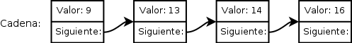

.. code:: python

    cadena = Nodo(9, Nodo(13, Nodo(14, Nodo(16))))
    
    print cadena.valor  # 9
    print cadena.siguiente.valor  # 13
    print cadena.siguiente.siguiente.valor  # 14
    print cadena.siguiente.siguiente.siguiente.valor  # 16

.. parsed-literal::

    9
    13
    14
    16

Si bien parece una estructura simple, cuando se la quiere usar no suele
ser tan práctica, por lo que se suelen armar estructuras a partir de
ella.

Pila
~~~~

Las pilas, también conocidas como estructuras *LIFO* (*Last In, First
Out*), nos permiten guardar una gran cantidad de elementos, pero obtener
siempre el ultimo elemento guardado.

.. code:: python

    class Pila(object):

        def __init__(self):
            self.primero = None
            self.tamanio = 0

        def __str__(self):
            pila = '<Pila: '
            siguiente = self.primero
            while siguiente:
                pila += '{} | '.format(siguiente.valor)
                siguiente = siguiente.siguiente

            pila +='>'
            return pila

        def apilar(self, elemento):
            """Guarda el elemento a insertar al final de la pila"""
            nodo = Nodo(elemento, self.primero)
            self.primero = nodo
            self.tamanio += 1

        def desapilar(self):
            """Quita y retorna último elemento insertado en la pila"""
            nodo = self.primero
            try:
                elemento = nodo.valor
            except AttributeError:
                raise Exception(u'No se puede desapilar elementos de una pila vacía')
            self.primero = nodo.siguiente
            self.tamanio -= 1

            return elemento

        def esta_vacia(self):
            """Devuelve True si la pila no contiene elementos y 
            False en el caso de que tenga al menos un elemento"""
            return not self.tamanio

Entonces, cuando nosotros creemos una pila simplemente haciendo:

.. code:: python

    p = Pila()

Lo que podríamos ver en la memoria es: |image0|

Al agregarle el número 5 a esa pila nos queda:

.. code:: python

    p.apilar(5)

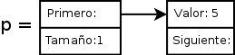

Y al agregar el número 7 nos queda:

.. code:: python

    p.apilar(7)

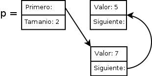

Y al agregar el número 9 nos queda:

.. code:: python

    p.apilar(9)

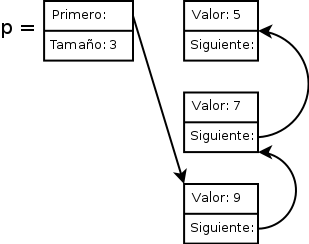

Y luego comenzamos a quitar elementos de la pila

.. code:: python

    ultimo = p.desapilar()  # 9

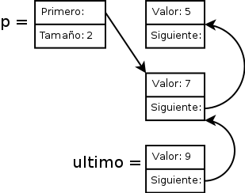

.. code:: python

    ultimo = p.desapilar()  # 7

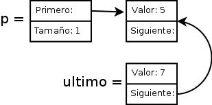

Teniendo en cuenta que una vez que desapilamos el 7 y la variable
llamada último pasa a apuntar al nodo recientemente desapilado, el nodo
anterior no queda referenciado por nadie,por lo que el mismo python se
encargará de liberar esa memoria donde se guardaba el número 9.

.. code:: python

    ultimo = p.desapilar()  # 5

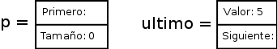

Cola
~~~~

Las colas, también conocidas como estructuras *FIFO* (*First In, First
Out*), nos permiten guardar una gran cantidad de elementos y después ir
quitandolos en el mismo orden en que los ingresamos.

.. code:: python

    class Cola(object):

        def __init__(self):
            self.primero = None
            self.ultimo = None
            self.tamanio = 0

        def __str__(self):
            cola = '<Cola: | '
            siguiente = self.primero
            while siguiente:
                cola += '{} | '.format(siguiente.valor)
                siguiente = siguiente.siguiente

            cola +='>'
            return cola

        def encolar(self, elemento):
            """Guarda el elemento a insertar al final de la cola"""
            nodo = Nodo(elemento)
            self.tamanio += 1
            if not self.primero:
                self.primero = nodo
            else:
                self.ultimo.siguiente = nodo

            self.ultimo = nodo

        def desencolar(self):
            """Quita y retorna el primer elemento insertado"""
            nodo = self.primero
            try:
                elemento = nodo.valor
            except AttributeError:
                raise Exception(u'No se puede desencolar más elementos')
            self.primero = nodo.siguiente
            self.tamanio -= 1

            return elemento

        def esta_vacia(self):
            """Devuelve True si la cola no contiene elementos y 
            False en el caso de que tenga al menos un elemento"""
            return not self.tamanio

Entonces, cuando nosotros creemos una cola simplemente haciendo:

.. code:: python

    c = Cola()

Lo que podríamos ver en la memoria es: |image1|

Al agregarle el número 5 a esa pila nos queda:

.. code:: python

    c.encolar(5)

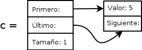

Como tenemos un único elemento, tanto primero como último apuntan al
mismo nodo. Y al agregar el número 7 nos queda:

.. code:: python

    c.encolar(7)

|image2| Como agregamos un nuevo elemento, ahora último dejó de apuntar
al primero y ambos hacen referencia a distintos nodos. Y al agregar el
número 9 nos queda:

.. code:: python

    c.encolar(9)

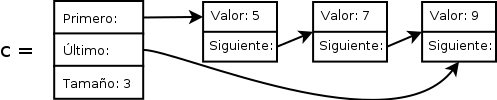

Y luego comenzamos a quitar elementos de la cola:

.. code:: python

    primero = c.desencolar()  # 5

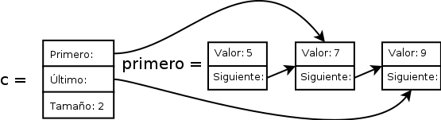

En este caso vemos que se modifica la referencia al primero, pero no al
último.

.. code:: python

    primero = c.desencolar()  # 7

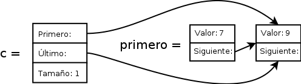

.. code:: python

    primero = c.desencolar()  # 9

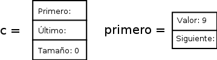

Lista
~~~~~

A diferencia de las estructuras anteriores, las listas soportan agregar,
obtener y eliminar elementos de cualquier posición.

.. code:: python

    class Lista(object):

        def __init__(self):
            self.primero = None
            self.cursor = None
            self.tamanio = 0

        def __str__(self):
            lista = '<Lista: '
            siguiente = self.primero
            while siguiente:
                lista += '{} | '.format(siguiente.valor)
                siguiente = siguiente.siguiente

            lista +='>'
            return lista

        def obtener_elemento(self):
            """Retorna el elemento de la posición actual"""
            try:
                return self.cursor.valor
            except AttributeError:
                raise Exception(u'La lista se encuentra vacía')

        def insertar_siguiente(self, elemento):
            """Guarda el elemento a insertar en la posición actual"""
            nodo = Nodo(elemento)
            if not self.primero:
                self.primero = nodo
            else:
                nodo.siguiente = self.cursor.siguiente
                self.cursor.siguiente = nodo

            self.cursor = nodo
            self.tamanio += 1

        def eliminar(self, posicion):
            """Elimina el elemento de la posición indicada"""
            if posicion > self.tamanio:
                msg = u'Se quiere borrar la posición {0} y la lista sólo tiene' \
                      u' {1} elementos'
                raise Exception(msg.format(posicion, self.tamanio))
            elif posicion == 1:
                nodo = self.primero
                self.primero = self.primero.siguiente
            else:
                nodo_anterior = self.primero
                pos_nodo = 2
                while pos_nodo < posicion:
                    nodo_anterior = nodo_anterior.siguiente
                    pos_nodo += 1

                nodo = nodo_anterior.siguiente

                if self.cursor == nodo_anterior.siguiente:
                    self.cursor = nodo_anterior.siguiente.siguiente

                if nodo_anterior.siguiente:
                    nodo_anterior.siguiente = nodo_anterior.siguiente.siguiente

            self.tamanio -= 1
            return nodo

        def ir_al_primero(self):
            """Posiciona el cursor apuntando al primer elemento de la lista"""
            self.cursor = self.primero

        def siguiente(self):
            """Avanza el cursor al siguiente elemento de la lista"""
            try:
                self.cursor = self.cursor.siguiente
            except AttributeError:
                msg = u'Error: La lista tiene {0.tamanio} elementos y quiere ' \
                      u'acceder a la posición {1}'
                pos = self.tamanio + 1
                raise IndexError(msg.format(self, pos))

        def esta_vacia(self):
            """Devuelve True si la cola no contiene elementos y 
            False en el caso de que tenga al menos un elemento"""
            return not self.tamanio

Si creamos una lista vacía:

.. code:: python

    l = Lista()

La podríamos ver en la memoria como: |image3|

Entonces, al insertar un elemento vemos que las referencias de primero y
cursor apuntan al mismo elemento:

.. code:: python

    l.insertar_siguiente(5)

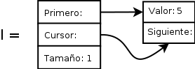

Cuando insertamos un segundo elemento, lo que hace es agregarlo y
apuntar el cursor a la posición del nuevo elemento:

.. code:: python

    l.insertar_siguiente(15)

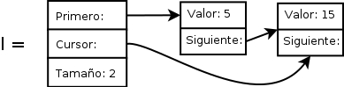

Lo mismo pasa al ingrear ahora el número 25:

.. code:: python

    l.insertar_siguiente(25)

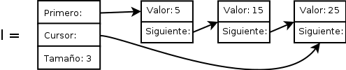

Si luego invocamos al método ``ir_al_primero`` el cursor pasa a apuntar
el primer elemento y al imprimir el resultado de ``obtener_elemento`` se
mostrará el número 5, sin quitarlo de la lista.

.. code:: python

    l.ir_al_primero()
    print l.obtener_elemento()

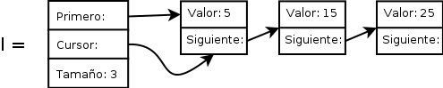

Al invocar al método llamado ``siguiente`` avanzará el cursor a la
siguiente posición. El ``print`` en este caso imprimirá el número 15.

.. code:: python

    l.siguiente()
    print l.obtener_elemento()

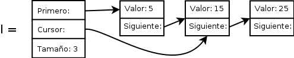

Si luego, parados en esa posición, insertamos el número 20, lo que va a
pasar es que la referencia a siguiente del nodo que contiene el número
15 pasa a apuntar el nuevo número 20. Y este nuevo nodo tiene que
apuntar al nodo que contiene el número 25.

.. code:: python

    l.insertar_siguiente(20)

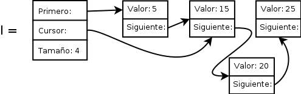

Si luego eliminamos el número de la posición 2, tenemos que reasignar la
referencia del nodo que tiene el número 5 al nodo que tiene el número
20. A su vez,como el cursor apunta a esa posición, también tenemos que
apuntarlo a la siguiente posición.

.. code:: python

    l.eliminar(2)

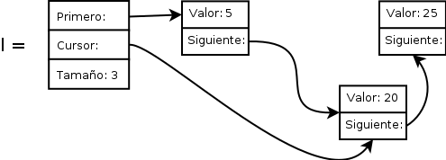

.. code:: python

    l.eliminar(2)

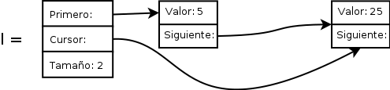

.. code:: python

    l.eliminar(2)

.. code:: python

    l.eliminar(1)

.. figure:: lista10.png
   :alt: 

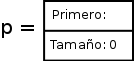
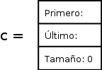
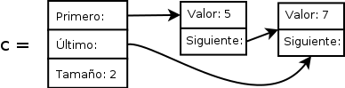
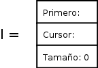
