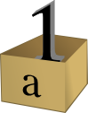
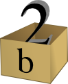

.. raw:: html

   <!--
   20/10
   Tipos de datos compuestos. Estructuras de control repetitivas. 
   Índices y slices
   Diccionarios como acumuladores/contadores
   -->

Tipos de datos compuestos
-------------------------

Listas
~~~~~~

En Python podemos guardar varios elementos usando
`listas <https://docs.python.org/2/tutorial/introduction.html#lists>`__

.. code:: python

    print 'Lista de números:'
    lista_de_numeros = [1, 6, 9, 5, 2]
    print lista_de_numeros
    print type(lista_de_numeros)
    
    # Pero en ningún lugar dice que la lista tiene que ser sólo
    # de números, por lo que podría definir mi lista_de_cosas
    # que tenga los mismos números que tenía antes y un string
    # en el medio:
    print '\nLista de cosas:'
    string = 'cadena_de_caracteres'
    lista_de_cosas = [1, 6, string, 9, 5, 2]
    print lista_de_cosas
    
    lista_de_cosas.append(string)
    print lista_de_cosas
    print type(lista_de_cosas)

.. parsed-literal::

    Lista de números:
    [1, 6, 9, 5, 2]
    <type 'list'>
    
    Lista de cosas:
    [1, 6, 'cadena_de_caracteres', 9, 5, 2]
    [1, 6, 'cadena_de_caracteres', 9, 5, 2, 'cadena_de_caracteres']
    <type 'list'>

Si se quiere saber si un número se encuentra en una lista o no, es muy
simple, sólo hay que usar el operador **in**:

.. code:: python

    print 'El {} esta en {}?: {}'.format(5, lista_de_numeros, 5 in lista_de_numeros)
    print 'El {} esta en {}?: {}'.format(7, lista_de_numeros, 7 in lista_de_numeros)

.. parsed-literal::

    El 5 esta en [1, 6, 9, 5, 2]?: True
    El 7 esta en [1, 6, 9, 5, 2]?: False

El operador **in** también funciona para strings (es *case sensitive*):

.. code:: python

    print 'mundo in "Hola mundo": ', 'mundo' in "Hola mundo"
    print 'MUNDO in "Hola mundo": ', 'MUNDO' in "Hola mundo"

.. parsed-literal::

    mundo in "Hola mundo":  True
    MUNDO in "Hola mundo":  False

A diferencia de los strings, en las listas si podemos cambiar un
elemento cualquiera:

.. code:: python

    lista_de_numeros = [1, 6, 3, 9, 5, 2]
    print lista_de_numeros
    lista_de_numeros[3] = 152
    print lista_de_numeros

.. parsed-literal::

    [1, 6, 3, 9, 5, 2]
    [1, 6, 3, 152, 5, 2]

En ningún momento dijimos que la lista era de enteros, por lo que
tranquilamente podemos guardar elementos de distintos tipos de datos

.. code:: python

    lista_de_cosas = [2, 5.5, 'letras', [1, 2, 3], 
                      ('tupla', 'de', 'strings')]
    print lista_de_cosas

.. parsed-literal::

    [2, 5.5, 'letras', [1, 2, 3], ('tupla', 'de', 'strings')]

Para eliminar un elemento sólo tenemos que usar la función **del** e
indicar la posición.

.. code:: python

    lista_de_cosas = [2, 5.5, 'letras', [1, 2, 3],
                      ('tupla', 'de', 'strings')]
    print 'Lista de cosas:', lista_de_cosas
    
    del lista_de_cosas[3]
    print 'Después de eliminar la posición 3:', lista_de_cosas

.. parsed-literal::

    Lista de cosas: [2, 5.5, 'letras', [1, 2, 3], ('tupla', 'de', 'strings')]
    Después de eliminar la posición 3: [2, 5.5, 'letras', ('tupla', 'de', 'strings')]

.. code:: python

    lista_de_numeros = [1, 2]
    
    if lista_de_numeros:
        print 'la lista tiene elementos'
    else:
        print 'la lista no tiene elementos'

.. parsed-literal::

    la lista tiene elementos

Y con las listas también se pueden hacer *slices*:

.. code:: python

    print 'primer elemento:', lista_de_cosas[0]
    ultimo = lista_de_cosas[-1]
    print 'último:', ultimo
    print 'del_segundo_al_ultimo_sin_incluirlo:', lista_de_cosas[1:4]
    print 'del_segundo_al_ultimo_sin_incluirlo:', lista_de_cosas[1:-1]
    print 'del_segundo_al_ultimo_incluyendolo:', lista_de_cosas[1:]

.. parsed-literal::

    primer elemento: 2
    último: ('tupla', 'de', 'strings')
    del_segundo_al_ultimo_sin_incluirlo: [5.5, 'letras', ('tupla', 'de', 'strings')]
    del_segundo_al_ultimo_sin_incluirlo: [5.5, 'letras']
    del_segundo_al_ultimo_incluyendolo: [5.5, 'letras', ('tupla', 'de', 'strings')]

Existe una función llamada *range* que crea permite crear listas de
números:

.. code:: python

    print range.__doc__
    print
    print 'Ejemplos:'
    print '  range(15):', range(15)
    print '  range(15)[2:9]:', range(15)[2:9]
    print '  range(15)[2:9:3]:', range(15)[2:9:3]
    print '  range(2,9):', range(2,9)
    print '  range(2,9,3):', range(2,9,3)

.. parsed-literal::

    range(stop) -> list of integers
    range(start, stop[, step]) -> list of integers
    
    Return a list containing an arithmetic progression of integers.
    range(i, j) returns [i, i+1, i+2, ..., j-1]; start (!) defaults to 0.
    When step is given, it specifies the increment (or decrement).
    For example, range(4) returns [0, 1, 2, 3].  The end point is omitted!
    These are exactly the valid indices for a list of 4 elements.
    
    Ejemplos:
      range(15): [0, 1, 2, 3, 4, 5, 6, 7, 8, 9, 10, 11, 12, 13, 14]
      range(15)[2:9]: [2, 3, 4, 5, 6, 7, 8]
      range(15)[2:9:3]: [2, 5, 8]
      range(2,9): [2, 3, 4, 5, 6, 7, 8]
      range(2,9,3): [2, 5, 8]

Tuplas
~~~~~~

Las
`tuplas <https://docs.python.org/2/tutorial/datastructures.html#tuples-and-sequences>`__
son listas inmutables, es decir, que no se pueden modificar. Si no se
pueden modificar, ¿para qué existen?. Porque crearlas es mucho más
eficiente que crear listas y en muchas ocasiones, como con las
constantes, queremos crear variables que no se modifiquen.

.. code:: python

    tupla = (1, 2, 3, 4)  # Se usa paréntesis en lugar de corchetes
    print tupla
    
    tupla = tupla[2:4]
    print tupla
    print type(tupla)

.. parsed-literal::

    (1, 2, 3, 4)
    (3, 4)
    <type 'tuple'>

Diccionarios
~~~~~~~~~~~~

El equivalente a los registros de Pascal serían los
`diccionarios <https://docs.python.org/2/tutorial/datastructures.html#dictionaries>`__,
pero éstos también ofrecen mayor flexibilidad:

.. code:: python

    print 'Podría usar los registros para guardar los datos de un alumno'
    
    registro = {
        'padron': 98128,
        'nombre': 'Rodriguez, Carlos'
    }
    
    print registro
    print type(registro)
    print
    
    print 'Y una vez que el alumno rinda el parcial, le puedo agregar',
    print ' la nota a ese registro'
    
    registro['nota'] = 6
    print registro
    print 
    
    print 'Incluso le puedo agregar un diccionario que tenga las notas',
    print 'de los trabajos prácticos. '
    registro['TPs'] = {1: 4, 2: 8}
    print registro
    print 'Prestar atención que las claves del diccionario de trabajo',
    print 'práctico son números enteros.'
    print 'La nota del TP 2 es:', registro['TPs'][2]

.. parsed-literal::

    Podría usar los registros para guardar los datos de un alumno
    {'nombre': 'Rodriguez, Carlos', 'padron': 98128}
    <type 'dict'>
    
    Y una vez que el alumno rinda el parcial, le puedo agregar  la nota a ese registro
    {'nombre': 'Rodriguez, Carlos', 'nota': 6, 'padron': 98128}
    
    Incluso le puedo agregar un diccionario que tenga las notas de los trabajos prácticos. 
    {'TPs': {1: 4, 2: 8}, 'nombre': 'Rodriguez, Carlos', 'nota': 6, 'padron': 98128}
    Prestar atención que las claves del diccionario de trabajo práctico son números enteros.
    La nota del TP 2 es: 8

Además, se pueden usar los campos de un registro para armar una forma
más simple los strings:

.. code:: python

    alumno = {
        'nombre': 'Juan',
        'apellido': 'Perez',
        'nota': 4
    }
    
    print 'El alumno {nombre} {apellido} se sacó un {nota}'.format(**alumno)

.. parsed-literal::

    El alumno Juan Perez se sacó un 4

Y si le queremos modificar la nota a un alumno, sólo tenemos que acceder
a ese campo y asignarle un nuevo valor:

.. code:: python

    alumno = {
        'nombre': 'Juan',
        'apellido': 'Perez',
        'nota': 2
    }
    print alumno
    
    alumno['nota'] = 5
    print alumno

.. parsed-literal::

    {'nombre': 'Juan', 'nota': 2, 'apellido': 'Perez'}
    {'nombre': 'Juan', 'nota': 5, 'apellido': 'Perez'}

O incluso se le puede cambiar el tipo de dato a un campo y agregar uno
nuevo:

.. code:: python

    alumno = {
        'nombre': 'Juan',
        'apellido': 'Perez',
        'parcial': 2
    }
    print 'Alumno:', alumno
    
    
    alumno['parcial'] = [2, 6]  # Cambio el tipo de dato de int a list
    print 'Agrego la nota del recuperatorio:', alumno
    
    alumno['coloquio'] = 8  # Agrego un nuevo campo
    print 'Agrego la nota del coloquio:', alumno
    
    del alumno['parcial']  # Elimino el campo nota
    print 'Elimino las notas del parcial:', alumno

.. parsed-literal::

    Alumno: {'nombre': 'Juan', 'parcial': 2, 'apellido': 'Perez'}
    Agrego la nota del recuperatorio: {'nombre': 'Juan', 'parcial': [2, 6], 'apellido': 'Perez'}
    Agrego la nota del coloquio: {'nombre': 'Juan', 'coloquio': 8, 'parcial': [2, 6], 'apellido': 'Perez'}
    Elimino las notas del parcial: {'nombre': 'Juan', 'coloquio': 8, 'apellido': 'Perez'}

Algo que hay que tener en cuenta es que el orden en que se asignan los
campos a un registro no es el orden interno de esos campos.

Cajas vs Etiquetas
------------------

A diferencia de otros lenguajes, Python no trabaja con el concepto de
variables como una caja donde podemos guardar valores. En su lugar, usa
las variables como etiquetas que hacen referencia a valores, que si bien
son parecidos, no son exactamente lo mismo. Cuando decimos que guardamos
un valor en una caja, lo que en realidad hace la computadora es acceder
a una posición de memoria y escribir en esa posición.

+----------+-------------+---------------+
| Ejemplo  | Cajas       | Etiquetas     |
+==========+=============+===============+
| Si a la  | Guardamos   | Hacemos que   |
| variable | el valor 1  | la referencia |
| **a** le | en la caja  | **a** apunte  |
| asignamo | **a**       | al valor 1    |
| s        | |image0|    | |image1|      |
| el       |             |               |
| número 1 |             |               |
+----------+-------------+---------------+
| Y cuando | Pisamos el  | Nuestra       |
| a esa    | valor de    | referencia    |
| variable | **a** y     | deja de       |
| queremos | guardamos   | apuntar a     |
| asignarl | el valor 2  | donde lo      |
| e        | |image2|    | hacía antes y |
| el       |             | ahora apunta  |
| número   |             | a una nueva   |
| dos      |             | posición de   |
|          |             | memoria       |
|          |             | quedando el   |
|          |             | número 1 sin  |
|          |             | ser apuntado  |
|          |             | por nadie     |
|          |             | |image3|      |
|          |             | |image4|      |
+----------+-------------+---------------+
| Y al     | En este     | Al copiar el  |
| decir    | caso se     | contenido, lo |
| que la   | crea una    | que se copia  |
| variable | nueva caja  | es la         |
| **a** es | con el      | referencia    |
| igual a  | valor 2     | |image7|      |
| la       | |image5|    |               |
| variable | |image6|    |               |
| **b** lo |             |               |
| que      |             |               |
| sucede   |             |               |
| es que   |             |               |
| se copia |             |               |
| el       |             |               |
| contenid |             |               |
| o        |             |               |
| de **a** |             |               |
| en **b** |             |               |
+----------+-------------+---------------+

Esto en python se puede ver usando la función
`id <https://docs.python.org/2/library/functions.html#id>`__:

.. |image1| image:: a1tag.png
.. |image2| image:: a2box.png
.. |image3| image:: 1.png
.. |image4| image:: a2tag.png
.. |image5| image:: a2box.png

.. |image7| image:: ab2tag.png

.. code:: python

    print 'La posición del número 1 es:', id(1)
    x = 1
    print 'La posición de X que apunta al número 1 es:', id(x)
    print '¿Y si al número 1 lo incremento?'
    x += 1
    print 'La posición de X ahora apunta a:', id(x)
    lista_de_unos = [1, 1, 1, 1, 1]
    print 'La lista tiene los elementos:', lista_de_unos
    posiciones_de_memoria = [id(1), id(1), id(1), id(1), id(1)]
    
    print 'Las posiciones de esos elementos son:', posiciones_de_memoria

.. parsed-literal::

    La posición del número 1 es: 10531192
    La posición de X que apunta al número 1 es: 10531192
    ¿Y si al número 1 lo incremento?
    La posición de X ahora apunta a: 10531168
    La lista tiene los elementos: [1, 1, 1, 1, 1]
    Las posiciones de esos elementos son: [10531192, 10531192, 10531192, 10531192, 10531192]

Tipos de datos mutables e inmutables
------------------------------------

En python se pueden diferenciar entre los tipos de datos en mutables e
inmutables. Que una variable sea inmutable significa que cada vez que se
la modifica, en realidad, lo que sucede es que se crea un nuevo valor y
esa variable pasa a apuntarlo:

.. code:: python

    x = 1
    print 'El valor de X es:', x
    print 'La posición de X que apunta al número 1 es:', id(x)
    print '¿Y si al número 1 lo incremento?'
    x += 1
    print 'El valor de X es:', x
    print 'La posición de X ahora apunta a:', id(x)

.. parsed-literal::

    El valor de X es: 1
    La posición de X que apunta al número 1 es: 10531192
    ¿Y si al número 1 lo incremento?
    El valor de X es: 2
    La posición de X ahora apunta a: 10531168

En cambio, cuando lo que hacemos es modificar una variable mutable, como
pueden ser las listas, lo que sucede es que esa variable sigue apuntando
al mismo lugar, pero ahora lo que se modificó es el valor que contiene:

.. code:: python

    x = []
    print 'El valor de X es:', x
    print 'La posición de X que apunta a la lista vacía es:', id(x)
    print '¿Y si le agrego el número 1 a la lista?'
    x.append(1)
    print 'Ahora, la lista X tiene los elementos:', x
    print 'Y sin embargo, la posición a la que apunta X es:', id(x)
    print 
    x = [1, 2, 3]
    print 'Sin embargo, si a X le asignamos una nueva lista:', id(x)

.. parsed-literal::

    El valor de X es: []
    La posición de X que apunta a la lista vacía es: 140290496224504
    ¿Y si le agrego el número 1 a la lista?
    Ahora, la lista X tiene los elementos: [1]
    Y sin embargo, la posición a la que apunta X es: 140290496224504
    
    Sin embargo, si a X le asignamos una nueva lista: 140290482456840

Los tipos de datos **inmutables** son: \* int \* str \* long \* float \*
bool \* None \* tuple

Los tipos de datos **mutables** son: \* list \* dict \* set

Para más información sobre la modificación de variables mutables e
inmutables pueden ver el siguiente
`link <http://www.mclibre.org/consultar/python/lecciones/python_variables_2.html#L1822>`__

Estructuras de control repetitivas
==================================

Así como en Pascal se delimitan los bloques de código con las palabras
reservadas *begin* y *end*, en Python se usan la indentación (espacios)
para determinar qué se encuentra dentro de una estructura de control y
qué no.

for
---

Si queremos imprimir los números del 0 al 14 podemos crear una lista con
range y usar el for para imprimir cada valor:

.. code:: python

    print range(15)
    for i in range(15):
        print i

.. parsed-literal::

    [0, 1, 2, 3, 4, 5, 6, 7, 8, 9, 10, 11, 12, 13, 14]
    0
    1
    2
    3
    4
    5
    6
    7
    8
    9
    10
    11
    12
    13
    14

Incluso, si queremos imprimir los valores de una lista que nosotros
armamos, también podemos hacerlo:

.. code:: python

    for i in [1, 6, 3, 9, 5, 2]:
        print i

.. parsed-literal::

    1
    6
    3
    9
    5
    2

Y si queremos imprimir cada elemento de la lista junto con su posición
podemos usar la función enumerate:

.. code:: python

    lista = range(15, 30, 3)
    print lista
    for idx, value in enumerate(lista):
        print '{0}: {1}'.format(idx, value)

.. parsed-literal::

    [15, 18, 21, 24, 27]
    0: 15
    1: 18
    2: 21
    3: 24
    4: 27

También se puede usar la función zip para ir tomando los primeros
elementos de una lista, después los segundos, y así sucesivamente

.. code:: python

    for par in zip([1, 2, 3], [4, 5, 6]):
        print par

.. parsed-literal::

    (1, 4)
    (2, 5)
    (3, 6)

Y en realidad, se puede iterar sobre cualquier elemento *iterable*, como
por ejemplo los strings:

.. code:: python

    for caracter in "Hola mundo":
        print caracter

.. parsed-literal::

    H
    o
    l
    a
     
    m
    u
    n
    d
    o

También se pueden iterar listas que tengan distintos tipos de elementos,
pero hay que tener en cuenta qué se quiere hacer con ellos:

.. code:: python

    lista = [1, 2, "12", "34", [5, 6]]
    print 'La lista tiene los elementos:', lista
    for elemento in lista:
        print '{0}*2: {1}:'.format(elemento, elemento*2)

.. parsed-literal::

    La lista tiene los elementos: [1, 2, '12', '34', [5, 6]]
    1*2: 2:
    2*2: 4:
    12*2: 1212:
    34*2: 3434:
    [5, 6]*2: [5, 6, 5, 6]:

while
-----

El ciclo while también ejecuta un bloque de código mientras la condición
sea verdadera:

.. code:: python

    numero = 5
    while numero < 10:
        print numero
        numero += 1

.. parsed-literal::

    5
    6
    7
    8
    9

Las listas tienen una función llamada pop que lo que hace es tomar el
último elemento de ella y lo elimina:

.. code:: python

    lista = range(5)
    print 'La lista antes de entrar al while tiene:', lista
    while lista:  # Si la lista no esta vacía, sigo sacando elementos
        print lista.pop()
    
    print 'La lista después de salir del while tiene:', lista

.. parsed-literal::

    La lista antes de entrar al while tiene: [0, 1, 2, 3, 4]
    4
    3
    2
    1
    0
    La lista después de salir del while tiene: []

Aunque también podría obtener el primero:

.. code:: python

    lista = range(5)
    print 'La lista antes de entrar al while tiene:', lista
    while lista:  # Si la lista no esta vacía, sigo sacando elementos
        print lista.pop(0)
    
    print 'La lista después de salir del while tiene:', lista

.. parsed-literal::

    La lista antes de entrar al while tiene: [0, 1, 2, 3, 4]
    0
    1
    2
    3
    4
    La lista después de salir del while tiene: []

Ejercicios
==========

1. Dado un número N, calcular su factorial
2. Procesar una lista de números enteros, e imprimir para cada uno de
   ellos:

-  el número que se esta procesando
-  la suma parcial de los mismos

3. La relación entre temperaturas Celsius y Fahrenheit está dada por:

   .. math:: C = 5/9 * (F-32)

   Escribir un algoritmo que haga una tabla de valores
   Celsius-Fahrenheit, para valores entre O F y 200 F , con intervalos
   de 10 grados.
4. Procesar una lista de números enteros, e imprimir para cada uno de
   ellos:

-  el número que se esta procesando
-  la suma parcial de los mismos
-  True si el número era mayor al anterior y False en caso contrario

Cortar cuando se los haya procesado a todos, o al alcanzar una suma
parcial mayor o igual a 100 5. Procesar una lista de números y generar
un diccionario con dos claves llamadas "par" e "impar". Al terminar de
procesar la lista el diccionario debe tener todos los números que
proceso agrupados en pares e impares.

Por ejemplo, si contamos con la lista [1, 5, 2, 6, 9, 3, 8], el
diccionario que se obtenga debería ser: {"par": [2, 6, 8], "impar": [1,
5, 9, 3]} 6. Escribir un programa que dadas dos listas de igual longitud
imprima la suma de ellas posición a posición. 7. Suponiendo que cuenta
con una lista en la que en cada posición tiene la información de un
alumno en un registro:
``Python [{'nombre': 'XX', 'padrón': 1, 'nota': 4, 'grupo': 1}, ...]``
1. Se desea imprimir el nombre y padrón de todos los alumnos aprobados.
2. Asumiendo que la lista se encuentra ordenada por número de grupo, se
pide indicar aquellos grupos para los cuales todos sus integrantes hayan
aprobado el parcial recorriendo sólo una vez la lista. 8. Se cuenta con
dos listas de números ordenadas de forma creciente y se desea obtener
una nueva lista ordenada que contenga todos los números, pero sin
ordenarla nuevamente. 10. Procesar una lista de strings e ir guardando
en un diccionario la cantidad de ocurrencias de cada palabra (distinguir
mayúsculas y minúsculas). Por ejemplo, para la lista
``Python ['Otra', 'posible', 'clasificacion', 'radica', 'en', 'si', 'una', 'variable', 'puede', 'cambiar', 'el', 'tipo', 'de', 'dato', 'que', 'se', 'puede', 'almacenar', 'en', 'ella', 'entre', 'una', 'sentencia', 'y', 'la', 'siguiente', '(', 'tipado', 'dinamico', ')', 'O', 'si', 'en', 'la', 'etapa', 'de', 'definicion', 'se', 'le', 'asigna', 'un', 'tipo', 'de', 'dato', 'a', 'una', 'variable', 'y', 'por', 'mas', 'que', 'se', 'puede', 'cambiar', 'el', 'contenido', 'de', 'la', 'misma', 'no', 'cambie', 'el', 'tipo', 'de', 'dato', 'de', 'lo', 'que', 'se', 'almacena', 'en', 'ella', '(', 'tipado', 'estatico', ')']``
El resultado sería:

.. code:: python

      {'el': 3, 'en': 4, 'etapa': 1, 'por': 1, 'Otra': 1, 'contenido': 1, 'almacenar': 1, 'sentencia': 1, 'le': 1, 'tipo': 3, 'la': 3, ')': 2, '(': 2, 'almacena': 1, 'estatico': 1, 'dinamico': 1, 'mas': 1, 'cambiar': 2, 'tipado': 2, 'ella': 2, 'de': 6, 'definicion': 1, 'puede': 3, 'dato': 3, 'que': 3, 'O': 1, 'variable': 2, 'asigna': 1, 'entre': 1, 'a': 1, 'siguiente': 1, 'posible': 1, 'clasificacion': 1, 'no': 1, 'radica': 1, 'una': 3, 'si': 2, 'un': 1, 'misma': 1, 'lo': 1, 'y': 2, 'cambie': 1, 'se': 4}
